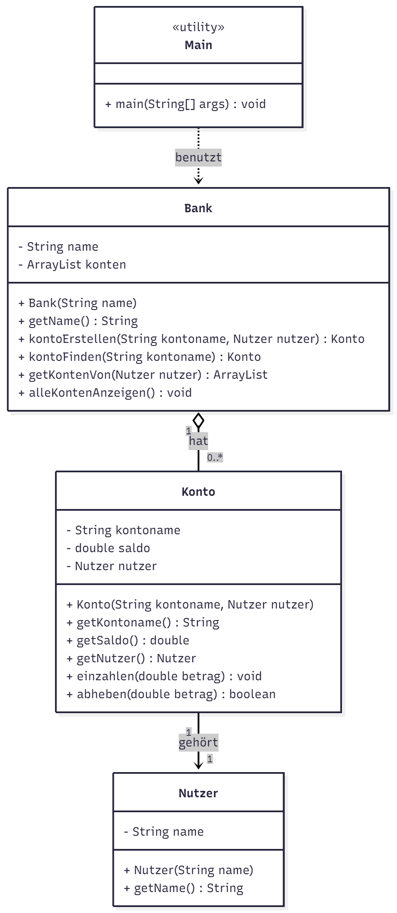

# Fragen

Müssen Getter/Setter im Diagramm sein?
→ Nein, müssen sie nicht.
Du kannst sie einzeichnen, aber es reicht, nur die relevanten Methoden zu zeigen.

Gehört die Klasse mit main() ins Diagramm?
→ Optional.
Wenn sie Teil der Architektur ist (wie hier), ja.
Sie ist aber eine „Utility“-Klasse.

Wann macht eine bidirektionale Beziehung Sinn?
→ Wenn beide Klassen voneinander wissen und sich gegenseitig referenzieren.
Das ist bei dir nicht der Fall.

Reicht eine Assoziation ohne Pfeil?
→ Ja, aber mit Pfeil ist besser, wenn die Richtung klar erkennbar sein soll.

